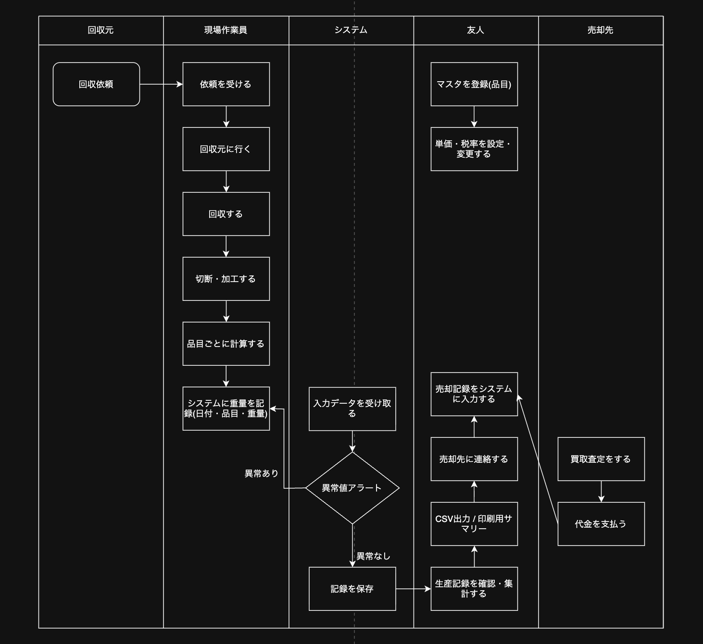
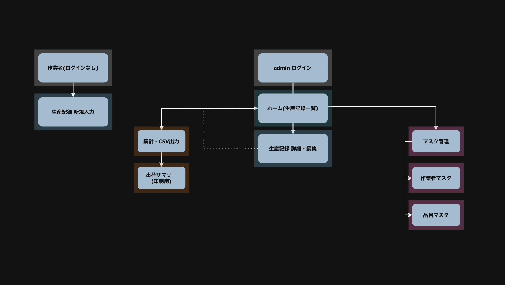
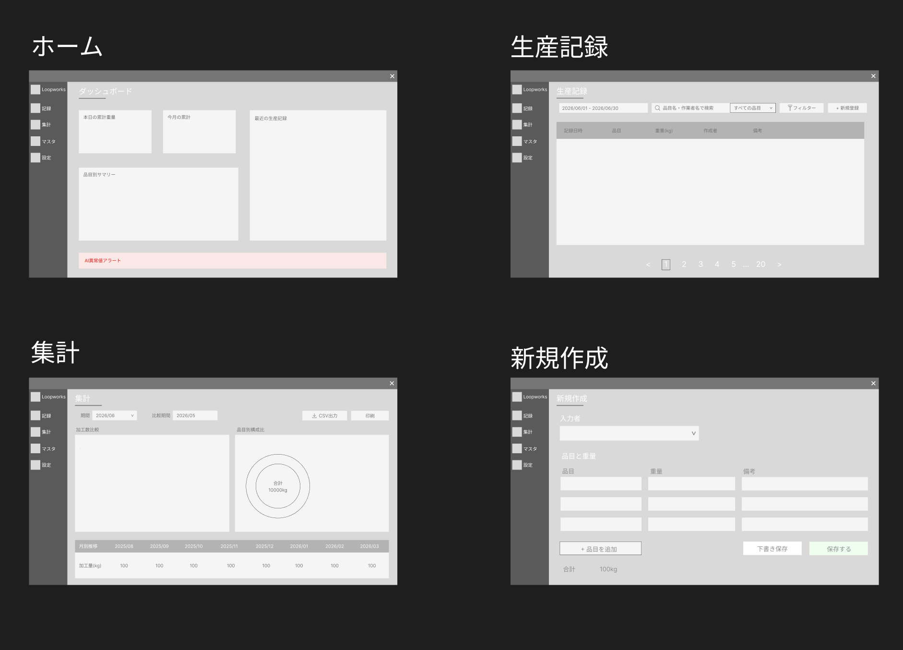
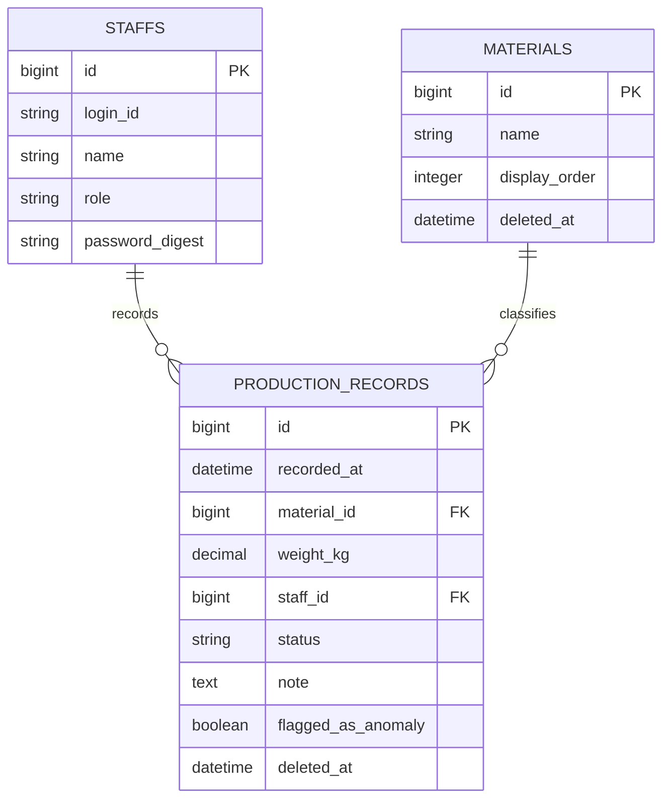

# Loopworks 設計

## 1. 業務フロー

## 1. 画面遷移図

## 3. ワイヤーフレーム

## 3. テーブル定義書
### テーブル一覧

| テーブル名 | 説明 |
|---|---|
| staffs | スタッフ（ログインユーザー）|
| materials | 品目マスタ |
| production_records | 生産記録 |

---

#### staffs

スタッフ情報を管理するテーブル。adminのみログイン機能を使用。staffはマスタから選択する形で入力者を特定する。

| カラム名 | 型 | NULL | デフォルト | 備考 |
|---|---|---|---|---|
| id | bigint | NO | 自動採番 | PK |
| login_id | string | NO | | ログインID（UNIQUE）|
| name | string | NO | | 氏名 |
| role | string | NO | | `admin` / `staff` |
| password_digest | string | NO | | bcryptでハッシュ化（has_secure_password）|
| created_at | datetime | NO | | Rails自動生成 |
| updated_at | datetime | NO | | Rails自動生成 |

**インデックス**
- `login_id`（UNIQUE）

**備考**
- `admin`は品目マスタの追加・編集・削除、生産記録の削除が可能。ログイン機能を使用する
- `staff`は生産記録の入力・閲覧のみ。ログインは不要で、入力時にプルダウンから自分を選ぶ形で入力者を記録する
- `admin`はセキュリティ上、しっかりしたパスワードを設定する

---

#### materials

品目マスタを管理するテーブル。使用中の品目は削除不可(論理削除で対応)。

| カラム名 | 型 | NULL | デフォルト | 備考 |
|---|---|---|---|---|
| id | bigint | NO | 自動採番 | PK |
| name | string | NO | | 品目名(例：鉄・銅・アルミ)|
| display_order | integer | NO | | 表示順 |
| deleted_at | datetime | YES | NULL | 論理削除用(NULL = 有効)|
| created_at | datetime | NO | | Rails自動生成 |
| updated_at | datetime | NO | | Rails自動生成 |

**インデックス**
- `deleted_at`

**備考**
- `production_records`から参照されている品目は削除不可
- 論理削除にはgem `paranoia` または `discard` を使用予定

---

#### production_records

現場で記録する生産記録（切断・回収量）を管理するテーブル。

| カラム名 | 型 | NULL | デフォルト | 備考 |
|---|---|---|---|---|
| id | bigint | NO | 自動採番 | PK |
| recorded_at | datetime | NO | | 記録日時 |
| material_id | bigint | NO | | FK → materials.id |
| weight_kg | decimal | NO | | 重量(kg)|
| staff_id | bigint | NO | | FK → staffs.id |
| status | string | NO | published | `draft`(下書き)/ `published`（公開）|
| note | text | YES | NULL | メモ（任意）|
| flagged_as_anomaly | boolean | NO | false | 異常値フラグ |
| deleted_at | datetime | YES | NULL | 論理削除用(NULL = 有効)|
| created_at | datetime | NO | | Rails自動生成 |
| updated_at | datetime | NO | | Rails自動生成 |

**インデックス**
- `material_id`
- `staff_id`
- `recorded_at`
- `status`
- `deleted_at`

**備考**
- 写真添付はActive Storageで管理するため、このテーブルにカラムは不要
- `weight_kg`は0以下の値を許容しない(アプリ側でバリデーション)
- `recorded_at`はdatetime型。入力時の日時を記録し、誰がいつ入力したかを後から確認できるようにする
- `status`のデフォルトは`published`。「保存する」を押したら即公開が基本動作で、あえて「下書き保存」を選んだときのみ`draft`になる。「保存したつもりが下書きのまま」という事故を防ぐための設計
- `flagged_as_anomaly`は、直近の同品目の平均重量から大きく外れた値が入力されたとき`true`になる。保存前に確認ダイアログを表示し、ユーザーが確認した上で登録した記録に付与される
- 削除は論理削除のみ。物理削除は行わない

---

#### ER図

